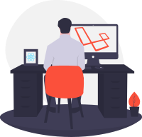

# Hello,

    

        :wave: I am a Full Stack Developer who specializes in helping clients rapidly solve coding or technical issues.
    

    

        :heavy_check_mark: Need someone to develop a highly secure backend and a frontend that provides the best mobile and desktop user experience? I can do that. 
        :heavy_check_mark: Need someone to fix, improve or add new features to your app's backend? I can do that. 
        :heavy_check_mark: Need someone to implement a new design, to add new pages or features to your front-end? I can do that. 
        :wrench: I can fix any issue that is preventing you from reaching success​ in your apps.
    

    
:computer: My programming languages of choice are PHP (Laravel framework) and JavaScript (mainly React.js) but I have also developed software for embedded systems in C++, desktop applications with Electron.js and games using Phaser framework.

    
:zap: I am constantly looking for new challenges and self-improvement.

    
	:envelope_with_arrow: If you are interested in a collaboration, do not hesitate to <a href="mailto:artizanatweb@gmail.com" target="_blank">drop me a message</a>!

    

    
    <a href="https://www.linkedin.com/in/danielcanadev/" target="_blank" alt="Linkedin profile" title="Linkedin profile">Linked<b>in</b> profile</a>

